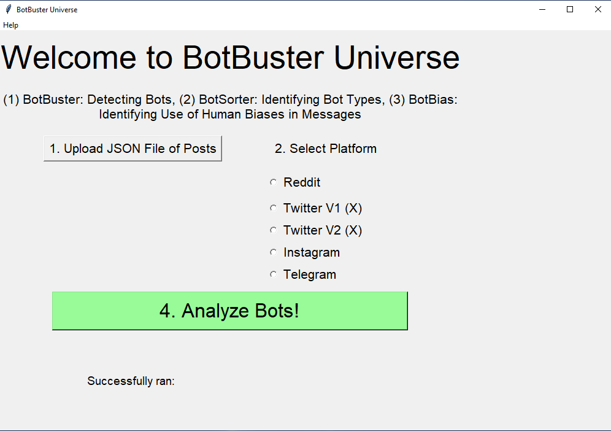

# BotBuster Universe

- BotBuster: Performs bot detection for Twitter (X), Reddit, Instagram bios, Telegram. 

- BotSorter: Identifies the type of user, in terms of : self-declared bot user, news user, bridging user, amplifier, cyborg, content generation, announcer and repeater.
Note that this does not differentiate into bot or not, and you should merge the results with the bot detection dataset to identify if the user is a bot or not with the properties.

- BotBias: Identifies the human bias present in a message, in terms of : homophily, affect bias, negativity bias, authority bias, illusory truth effect, availability bias, confirmation bias

## Installation
1. Install Python Version 3.9.7
2. Run `python -r requirements.txt`
3. Run `BotBuster_UI/python main_ui.py`

## Formatting Data
Check out test_data/

## Interpreting BotBuster Outputs
1. BotBuster outputs are stored in the file temp/.../*_bots.json
Use the column `botornot`. The user is a bot if the `humanprob` is greater than `botprob`
2. BotSorter outputs are stored in the file temp/.../*_botsorter.json
3. BotBias outputs are stored in the file temp/.../*_bias.json

## Reference Papers:
All Bot Detection and Analysis papers <a href="https://quarbby.github.io/research/botbuster_universe.html" target="_blank">here</a>. Select few are listed here:

*Key Citation*
```
@inproceedings{ng2023botbuster,
  title={Botbuster: Multi-platform bot detection using a mixture of experts},
  author={Ng, Lynnette Hui Xian and Carley, Kathleen M},
  booktitle={Proceedings of the international AAAI conference on web and social media},
  volume={17},
  pages={686--697},
  year={2023}
}
```

*Bot Detection Papers*
1. BotBuster: Ng, L. H. X., & Carley, K. M. (2023, June). Botbuster: Multi-platform bot detection using a mixture of experts. In Proceedings of the International AAAI Conference on Web and Social Media (Vol. 17, pp. 686-697).
3. BotBuster4Everyone: Ng, L. H. X., & Carley, K. M. (2024). Assembling a multi-platform ensemble social bot detector with applications to US 2020 elections. Social Network Analysis and Mining, 14(1), 1-16.
4. BotBuster Telegram: Ng, L. H. X., Kloo, I., & Carley, K. M. (2024). An Exploratory Analysis of COVID Bot vs Human Disinformation Dissemination stemming from the Disinformation Dozen on Telegram. arXiv preprint arXiv:2402.14203.
5. BotSorter and BotBias papers are under review. Watch this space for an update of preprint!! 

*Bot Analysis Papers*
1. Ng, L. H. X., Robertson, D. C., & Carley, K. M. (2024). Cyborgs for strategic communication on social media. Big Data & Society, 11(1), 20539517241231275.
2. Marigliano, R., Ng, L. H. X., & Carley, K. M. (2024). Analyzing Digital Propaganda and Conflict Rhetoric: A Study on Russia’s Bot-Driven Campaigns and Counter-Narratives during the Ukraine Crisis.
3. Ng, L. H. X., & Carley, K. M. (2023). Deflating the Chinese balloon: types of Twitter bots in US-China balloon incident. EPJ Data Science, 12(1), 63.

## Help me out!
If you see this and you love it, please help me out! 
I went through a heart transplant during my 3rd year of my PhD. The partial story is documented on my  <a href="https://quarbby.github.io/blog/hearttransplant.html" target="_blank">blog</a>. 
If you would like to make a donation to help my transplant costs, or my software engineering costs, you may use <a href="https://venmo.com/u/Lynnette-Ng" target="_blank" >Venmo</a> @Lynnette-Ng with last 4-digits as 1254, or <a href="https://paypal.me/lynnettenghx?country.x=SG" target="_blank">PayPal</a> @lynnettenghx.
It will be greatly appreciated. 

## Screenshots

