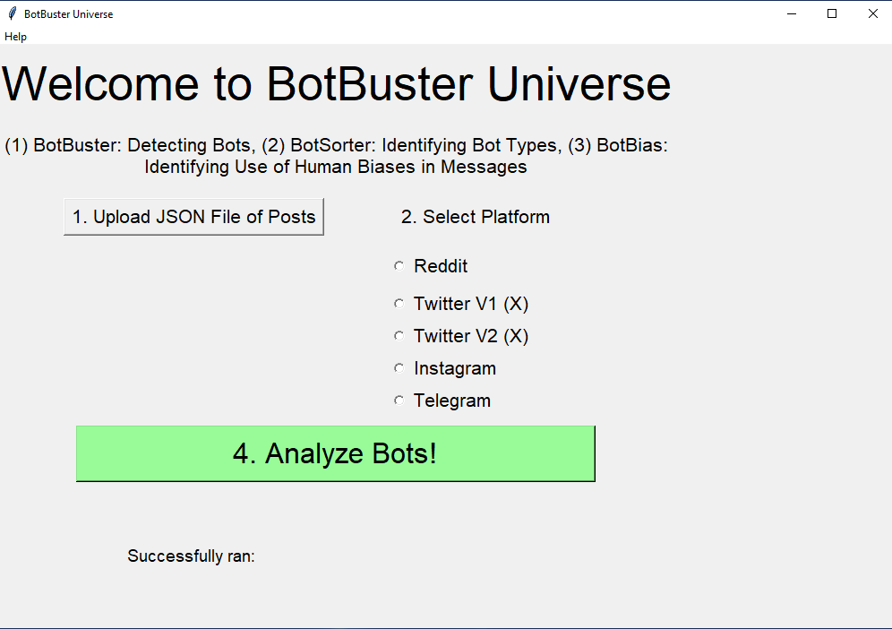

# BotBuster Universe

## Installation
1. Install Python Version 3.9.7
2. Run `python -r requirements.txt`
3. Run `BotBuster_UI/python main_ui.py`

## Formatting Data
Check out test_data/

You will need to run NetMapper v1.0.1.18 on your data and save the CUES file for import for bot bias

## Interpreting BotBuster Outputs
Use the column `botornot`. 
The user is a bot if the `humanprob` is greater than `botprob`

## Reference Papers:
All Bot Detection and Analysis papers: https://quarbby.github.io/research/botbuster_universe.html. Select few are listed here:

*Bot Detection Papers*
1. BotBuster: Ng, L. H. X., & Carley, K. M. (2023, June). Botbuster: Multi-platform bot detection using a mixture of experts. In Proceedings of the International AAAI Conference on Web and Social Media (Vol. 17, pp. 686-697).
2. BotBuster4Everyone: Ng, L. H. X., & Carley, K. M. (2024). Assembling a multi-platform ensemble social bot detector with applications to US 2020 elections. Social Network Analysis and Mining, 14(1), 1-16.
3. BotBuster Telegram: Ng, L. H. X., Kloo, I., & Carley, K. M. (2024). An Exploratory Analysis of COVID Bot vs Human Disinformation Dissemination stemming from the Disinformation Dozen on Telegram. arXiv preprint arXiv:2402.14203.
4. 

*Bot Analysis Papers*
1. Ng, L. H. X., Robertson, D. C., & Carley, K. M. (2024). Cyborgs for strategic communication on social media. Big Data & Society, 11(1), 20539517241231275.
2. Marigliano, R., Ng, L. H. X., & Carley, K. M. (2024). Analyzing Digital Propaganda and Conflict Rhetoric: A Study on Russia’s Bot-Driven Campaigns and Counter-Narratives during the Ukraine Crisis.
3. Ng, L. H. X., & Carley, K. M. (2023). Deflating the Chinese balloon: types of Twitter bots in US-China balloon incident. EPJ Data Science, 12(1), 63.

## Screenshots
